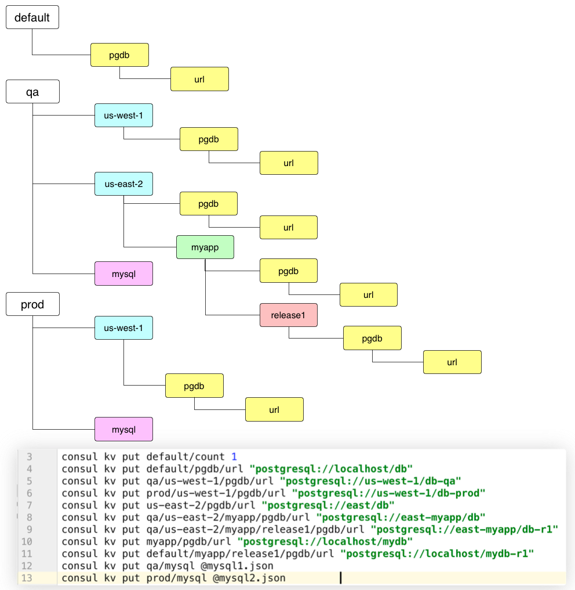
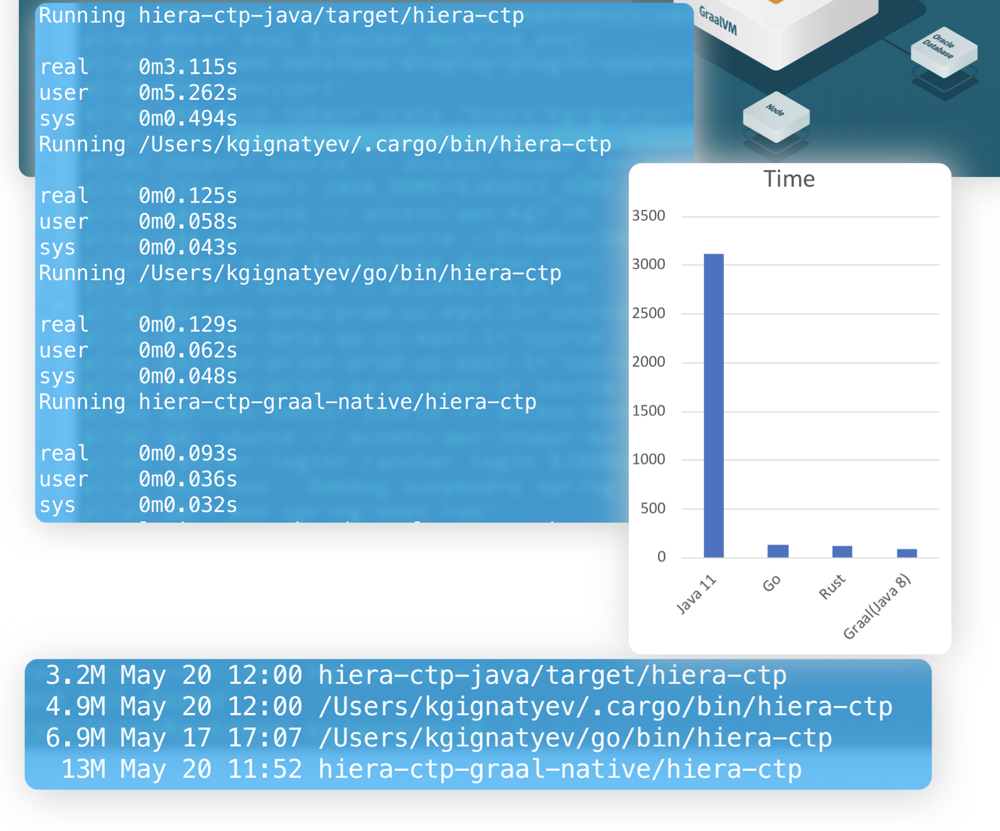
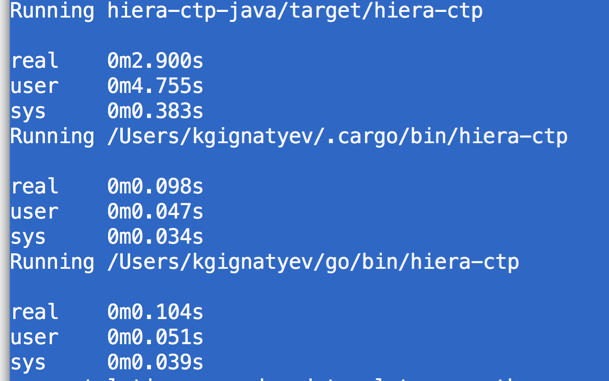

Consul Template Plugin for hierarchical  key lookup.
---

Inspired by  https://puppet.com/docs/puppet/5.4/hiera_intro.html

**Purpose**
Allow for hierarchical lookup of a value for a given key. 

given this data

and template 

	{{ $location := or (env "CLUSTER_LOCATION" ) "us-west-1" }}
    {{ $app := or (env "APP" ) "myapp"}}
    {{ $release := or (env "RELEASE" ) "release1"}}
    {{ $env := or (env "ENVIRONMENT" ) "qa"}}
	v={{plugin "hiera-ctp" "pgdb/url" $release $app $location $env  }}

when we render the template we see
	
	consul-template --vault-renew-token=false --once -template  "<in.tpl>:out.txt"
	
	v=postgresql://us-west-1/db-qa
	
	
if we set environment variable CLUSTER_LOCATION to us-east-2 we get different value

	export CLUSTER_LOCATION=us-east-2
	
	consul-template --vault-renew-token=false --once -template  "<in.tpl>:out.txt"
	
	v=postgresql://east-myapp/db-r1	 

Building
---

Just for experiment this utility is implemented in Java, Rust, and Go

It is possible to build just individual implementation by navigating to *[project root]*/hiera-ctp-*[lang]*
 and running ./build.sh

**Note**: Java version requires Java 11
**Graal-Native**: requires GraalVM with native image support

Before building it is necessary to set j11 and Graal homes as

	export JAVA11_HOME=<location>
    export GRAAL_HOME=<location>

 
Build them all 

	cd <project root>
	# make sure that Java 11 is used
	./build-all.sh
  

Testing
---

start local Consul and push test data

	cd <project root>/helpers
	./run-local-consul.sh &
	./set-sample-data.sh
	cd <project root>
	# make sure that Java 11 is used
	./build-all.sh
	./run-tests.sh
	

retrieve data individually, simply invoke executable and supply parameters: key first 
and then components of hierarhy, for example  

	hiera-ctp pgdb/url  us-west-1 qa 	
	<result> postgresql://us-west-1/db-qa	
	hiera-ctp pgdb/url  us-west-1 prod
    <result> postgresql://us-west-1/db-prod
    hiera-ctp pgdb/url  us-west-1 
    <result> postgresql://localhost/db 

Or it can be invoked in a language specific development way, for example for Rust we can run

    cd <project root>/hiera-ctp-rust
	cargo run pgdb/url qa us-west-1	
	
Performance
---

Rust implementation  is the fastest, GO is close second, and Java is much much slower,
and Java implementation consumes about 100 times(!) more CPU resources than other
implementations

	

Limitations
---

Currently requires Consul agent accessible at http://localhost:8500 	
	
